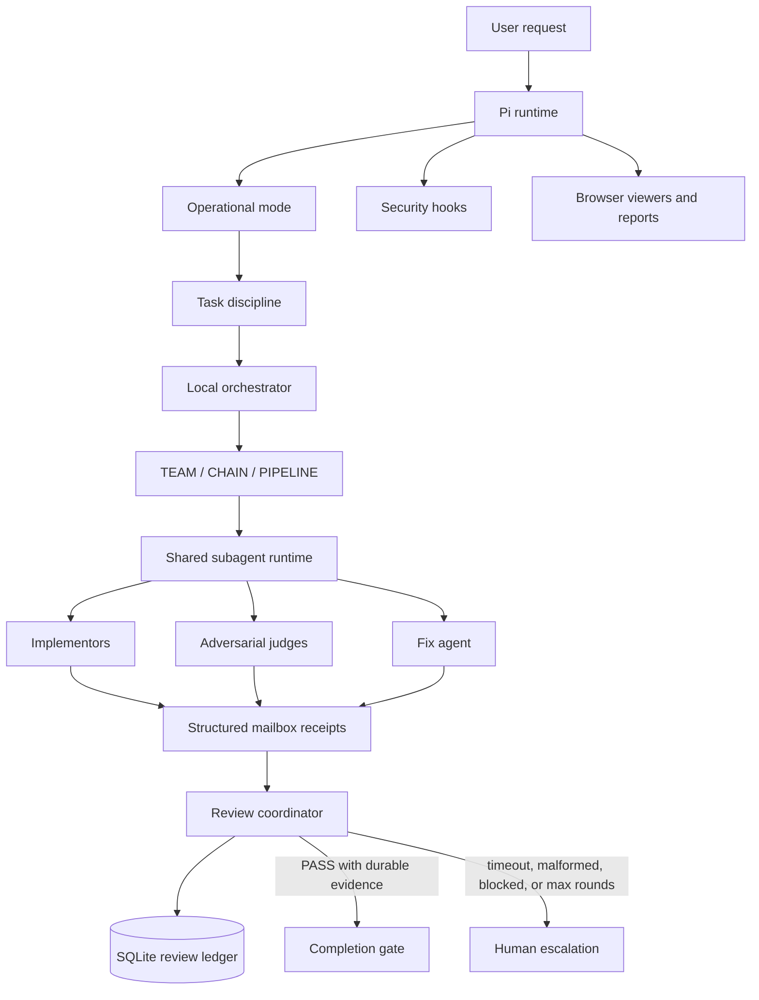
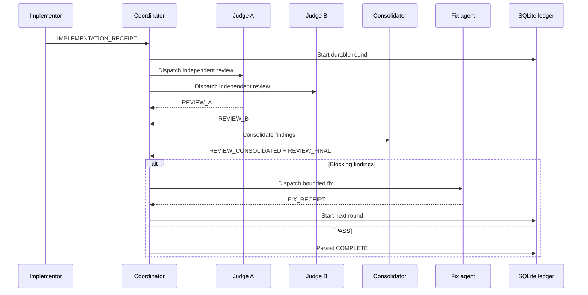

# agent-pi

> A local-first multi-agent engineering system for [Pi](https://github.com/badlogic/pi-mono).

agent-pi turns Pi from a single coding assistant into a reliable coordination runtime: structured planning, parallel and sequential agents, durable task state, adversarial review, security controls, and browser-based inspection—all as extensions, skills, prompts, and agent definitions.

Built with gratitude to **[Ruiz Rica](https://ruizrica.io)**, whose work this project grew from, and **[IndyDevDan](https://www.youtube.com/@indydevdan)**, whose Pi experimentation and teaching helped shape the direction.

## End goal

The end goal is a trustworthy local engineering loop:

1. Understand the request and establish explicit tasks.
2. Plan or specify the change before implementation.
3. Dispatch focused implementors with shared runtime contracts.
4. Review adversarially rather than assuming the implementation is correct.
5. Fix concrete findings and re-review within bounded rounds.
6. Persist receipts and completion state so restarts cannot silently imply success.
7. Report only what tests and durable evidence support.

No external orchestration service is required. The filesystem, Pi runtime, mailbox, and SQLite ledger are the coordination substrate.

## Architecture



### Durable SDD review loop

SDD review is coordinated inside the Pi extension runtime. An implementation receipt starts a bounded review round; independent judges inspect the full change; a consolidator produces the final verdict; blocking findings dispatch a fix agent; and only a persisted `REVIEW_FINAL: PASS` can satisfy the completion gate.

The ledger lives at `extensions/openspec/.review-ledger.sqlite` and uses SQLite transactions, WAL mode, foreign keys, busy timeouts, receipt deduplication, migration, and restart recovery. The database is generated runtime state and is ignored by Git.



## Seven operational modes

| Mode | Purpose |
|---|---|
| **NORMAL** | Standard coding assistant behavior. |
| **PLAN** | Plan-first work: inspect, propose, approve, implement, report. |
| **SPEC** | Requirements and spec-driven development. |
| **SDD** | OpenSpec implementation with durable adversarial review. |
| **PIPELINE** | Phased UNDERSTAND → GATHER → PLAN → EXECUTE → REVIEW workflow. |
| **TEAM** | Dispatch specialists while the coordinator owns orchestration. |
| **CHAIN** | Sequential agents where each step receives the previous output. |

Use `Shift+Tab` to cycle modes. `/co-op` starts cooperative multi-agent work.

## Core components

- `extensions/agent-orchestrator.ts` — local task groups, waves, agent registry, reconciliation, and dashboard integration.
- `extensions/agent-mailbox.ts` — file-based inter-agent messages with validated structured receipts.
- `extensions/lib/review-coordinator.ts` — compatibility facade for the durable review system.
- `extensions/lib/review/` — receipt validation, review state transitions, and SQLite persistence.
- `extensions/subagent-widget.ts` — background worker lifecycle, watchdogs, JSONL output, and mailbox injection.
- `extensions/lib/agent-defs.ts` — shared agent parsing, naming, and directory discovery.
- `extensions/lib/runtime-contract.ts` — typed contracts for Pi runtime globals and seams.
- `extensions/agent-team.ts` — dispatch-only team orchestration.
- `extensions/agent-chain.ts` — sequential chain execution.
- `extensions/pipeline-team.ts` — phased hybrid pipeline execution.
- `extensions/mode-cycler.ts` — operational mode switching.
- `extensions/security-engine.ts` — security scanning and protection controls.
- `extensions/plan-viewer.ts`, `completion-report.ts`, `spec-viewer.ts` — browser review surfaces.

## Repository layout

```text
agent-pi/
├── extensions/          TypeScript extensions and shared libraries
├── extensions/__tests__/ Vitest extension and integration tests
├── agents/              Agent definitions and YAML team/chain/pipeline configs
├── skills/              Reusable specialist skills
├── commands/            Markdown-driven toolkit commands
├── themes/              Terminal themes
├── tex/                 Offline text tools
├── openspec/            OpenSpec changes and generated review ledger
├── install.sh           Installer
└── package.json         Pi package manifest
```

## Install

```bash
git clone https://github.com/ruizrica/agent-pi.git
cd agent-pi
./install.sh
```

Or install into an existing Pi setup:

```bash
pi install git:github.com/ruizrica/agent-pi
```

Pi discovers the extensions, agents, themes, commands, and skills from the package.

## Common controls

- `Shift+Tab` — cycle operational modes
- `Ctrl+X` — cycle themes
- `/agents-team` — select an agent team
- `/chain` — select a chain
- `/co-op` — cooperative workers
- `/chat` — remote browser chat
- `/reports` — persisted plans, specs, and completion reports
- `/secure` — security sweep and protection installer
- `/tex` — open offline text tools

## Development and verification

Run the extension test suite:

```bash
cd extensions
npm test -- --run
```

The suite covers extension logic, mailbox and coordinator durability, orchestration wiring, security behavior, viewers, and end-to-end SDD flows.

Before committing:

```bash
git diff --check
git status --short
```

## Design principles

- **Local first:** coordination works without a hosted control plane.
- **Evidence over optimism:** completion requires durable receipts and passing tests.
- **Adversarial by default:** judges look for regressions, missing coverage, integration gaps, and incorrect assumptions.
- **Bounded autonomy:** retries and review rounds have explicit limits and escalation paths.
- **Shared contracts:** every spawned worker receives the same mailbox, runtime, and communication expectations.
- **Composable extensions:** Pi remains the runtime; agent-pi adds focused capabilities instead of forking it.

## Built on Pi

Pi provides the terminal UI, model runtime, tools, extension API, and conversation loop. agent-pi supplies the coordination architecture around it.

## License

[MIT](LICENSE)
